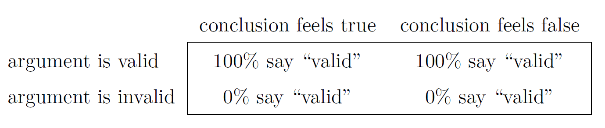
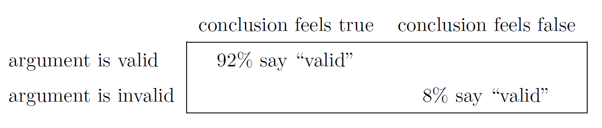
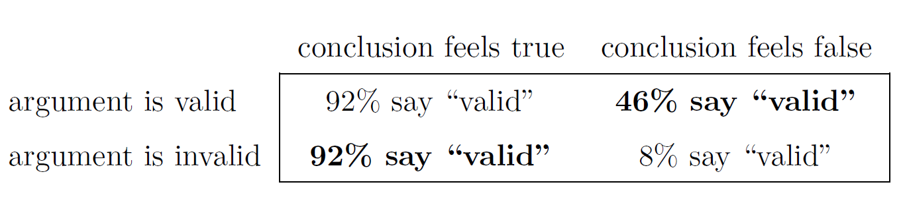

# Why do we learn statistics?

## 1.1 On the psychology of statistics

Why do you do statistics? Why don't scientis just use common sense?

**We don't trust ourselves enough**

We are humans, ans susceptible to all of the biases, tempations and failties that humans suffer from. 

**Much of the statistics is a safeward**

- The instincts of our "gut" aren't designed to solve scientific problems.Cultural evolution is expected to be faster than biological evolution (because of its Lamarckian nature, and because cultural information is transmitted through different routes than genetic information [still debated]).

### The curse of belief bias

People are mostly pretty smart, but we really do find it hard to be neutral, to evaluate evidence impartially and without being swayed by pre-existing biases.

- Valid argument, conclusion sounds true (we woulds say valid):

  * No cigarettes are inexpensive (Premise 1)
  * Some addictive things are inexpensive (Premise 2)
  * Therefore, some addictive things are not cigarettes (Conclusion)

- Argument valid, conclusions don't sound like true (we tend to say invalid):

  * No addictive things are inexpensive (Premise 1)
  * Some cigarettes are inexpensive (Premise 2)
  * Therefore, some cigarettes are not addictive (Conclusion)

- Argument partially invalid, conclusion sounds like true (we tend to say it is valid):

  * No addictive things are inexpensive (Premise 1)
  * Some cigarettes are inexpensive (Premise 2)
  * Therefore, some addictive things are not cigarettes (Conclusion)

- Invalud argument, conclusions sounds like false

  * No cigarettes are inexpensive (Premise 1)
  * Some addictive things are inexpensive (Premise 2)
  * Therefore, some cigarettes are not addictive (Conclusion)


Scenario assuming that people are really perfect able to set aside their pre-existing biases about what is true and what is in't, and purely evaluate an argument on its logical merits. We would expect:
```{r 1_table1,echo=FALSE, fig.align='center', fig.cap='table 1',fig.width=20}

```


Real experiment (Evans, Barston, Pollard, 1993). What they found is that when pre-existing biases (i.e., beliefs) were in agreement with the structureof the data, everything went the way you'd hope:
```{r 2_table2,echo=FALSE, fig.align='center', fig.cap='table 2',fig.width=20}

```


Not perfect, but that's pretty good. But look what happens when our intuitive feelings about the truth of the conclusion run against the logical structure of the argument:
```{r 3_table3,echo=FALSE, fig.align='center', fig.cap='table 3',fig.width=20}

```


What we can learn: When people are presented with strong argument that contradicts our pre-existing beliefs, we find it pretty hard to even perceive it to be a strong argument (people only did so 46% of the time). Even worse, when people are presented with a weak argument that agrees with our pre-existing biases, alsmos no-one can see thet the argument is weak! (people got that wrong 92% of the time)


**Statistics can be seen as a tool to increase your chances of making the right decisions**
It's just too easy for us to believe what we want to believe; so if we want to believe in the data we are going to need help to keep our personal biases under control


## 1.2 The cautionary tale of Simspn's paradox
Simpson’s Paradox is a statistical phenomenon where an association between two variables in a population emerges, disappears or reverses when the population is divided into subpopulations. For instance, two variables may be positively associated in a population, but be independent or even negatively associated in all subpopulations.


Suggested website about Simpson's paradox:
https://setosa.io/simpsons/#:~:text=In%201973%2C%20the%20University%20of,only%2035%25%20of%20female%20applicants.


## 1.3 Statistics in psychology

* Psychology is a statistical science
* At fundamental level psychology is harder than physics

**Can't someone else do the statistics?**

* Statistics is deeply interwinded with research desing.

* Statistics is basic to understand scientific literature

* Statistical is expensive


**We live in the 21st century, and data are evelywhere**

## 1.4. Statistics in everyday life

The author took the 20 most recent news articles posted to the ABC news website. Of those 20 articles, it turned out that 8 of them involved a discussion of something that I would call a statistical topic; 6 of those made a mistake. The most common error, if you’re curious, was failing to report baseline data (e.g., the article mentions that 5% of people in situation X have some characteristic Y, but doesn’t say how common the characteristic is for everyone else!)

**Basic knowledge of statistics is very helpful for trying to figure out when someone else is either making a mistake or even lying you**


## Meeting Videos

### Cohort 1

`r knitr::include_url("https://www.youtube.com/embed/URL")`

<details>
<summary> Meeting chat log </summary>

```
LOG
```
</details>
