# Descriptive statistics.

Descriptive statistics: summarising the data in a compact, easily understood fashion.

afl.finalists names of all 400 teams that played in all 200 final matches played during the period 1987 to 2010

afrl.margins: winning marging (number of points) for all 176 games played during the 2010 season.

```{r}
load("data/aflsmall.Rdata")
library(lsr)
who() # in lsr package is to see what variales are stored in the file

head(afl.margins)
head(afl.finalists)
```


```{r}
hist(afl.margins)
```

## 5.1. Measures of central tendency

Most frequen mean, median and mode, ocasionally trimmed mean.
Notation of the book:

```{r f_mean_formula,echo=FALSE, fig.align='center', fig.cap='Mean formula',fig.width=20}
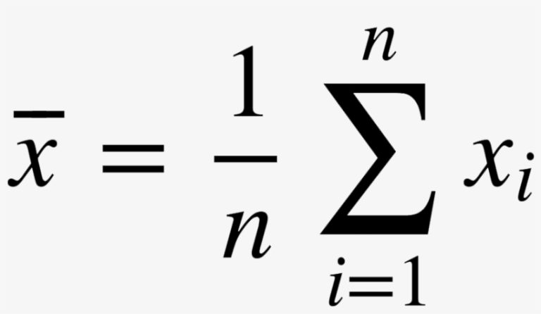
```
mean: average
median: middle value

```{r}
mean(afl.margins)
median(afl.margins)
```

### Mean or median? What's the difference?

* If your data are nominal scale, you probably shouldn’t be using either the mean or the median. Both
the mean and the median rely on the idea that the numbers assigned to values are meaningful. If
the numbering scheme is arbitrary, then it’s probably best to use the mode (Section 5.1.7) instead.

* If your data are ordinal scale, you’re more likely to want to use the median than the mean. The
median only makes use of the order information in your data (i.e., which numbers are bigger), but
doesn’t depend on the precise numbers involved. That’s exactly the situation that applies when
your data are ordinal scale. The mean, on the other hand, makes use of the precise numeric values
assigned to the observations, so it’s not really appropriate for ordinal data.

* For interval and ratio scale data, either one is generally acceptable. Which one you pick depends a
bit on what you’re trying to achieve. The mean has the advantage that it uses all the information
in the data (which is useful when you don’t have a lot of data), but it’s very sensitive to extreme
values, as we’ll see in Section 5.1.6.

```{r mean_median,echo=FALSE, fig.align='center', fig.cap='Figure 5.2. An illustration of the difference between how the mean and the median should be interpreted',fig.width=20}
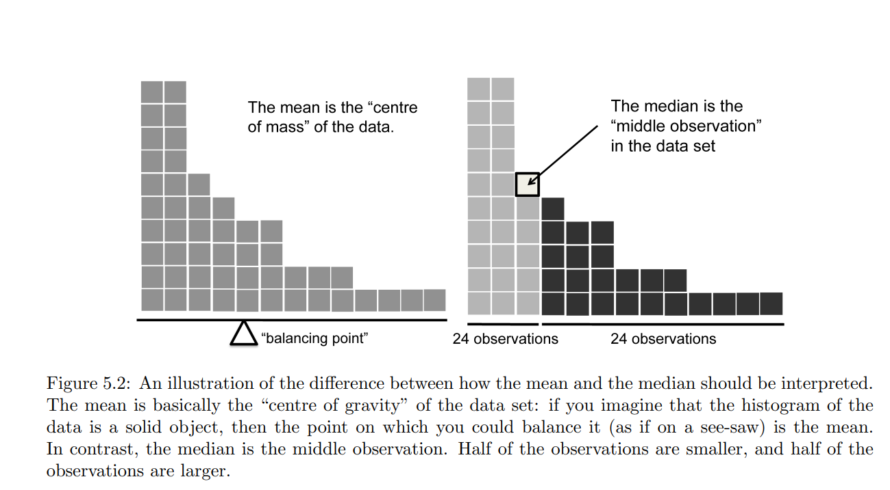
```

### Trimmed mean

When faced with a situation where some of the most extreme-valued observations might not be quite
trustworthy, the mean is not necessarily a good measure of central tendency. It is highly sensitive to one
or two extreme values, and is thus not considered to be a robust measure. One remedy that we’ve seen
is to use the median. A more general solution is to use a “trimmed mean”. To calculate a trimmed mean,
what you do is “discard” the most extreme examples on both ends (i.e., the largest and the smallest), and
then take the mean of everything else. The goal is to preserve the best characteristics of the mean and the
median: just like a median, you aren’t highly influenced by extreme outliers, but like the mean, you “use”
more than one of the observations.
```{r}
dataset<- c(-15,2,3,4,5,6,7,8,9,12)

mean(dataset)
median(dataset)

```

```{r}
mean(dataset,trim = 0.1) #10% treimmed mean
mean(dataset,trim = 0.05) #5% trimmed mean
```

### Mode

The value that occurs most frequently.
```{r}
table(afl.finalists)

modeOf(afl.finalists)

maxFreq(afl.finalists)
```

## 5.2 Measures of variability

### Range
```{r}
range(afl.margins)
```

### Interqurtile range

Quantile (more commonly called percentiles) is:
The 10th percentile of a data set is the smallest number x such that 10% of the data is less than x. 
The median of the data set is its 50th quantile/percentile

```{r}
median(afl.margins)

quantile(afl.margins,probs = 0.5)

quantile(afl.margins, probs = c(0.25,0.75))
```

```{r}
50.5-12.75

IQR(afl.margins)

```


### Mean absolute deviation


```{r mean_absolute_dev,echo=FALSE, fig.align='center', fig.cap='Mean absolute deviation calculation',fig.width=20}
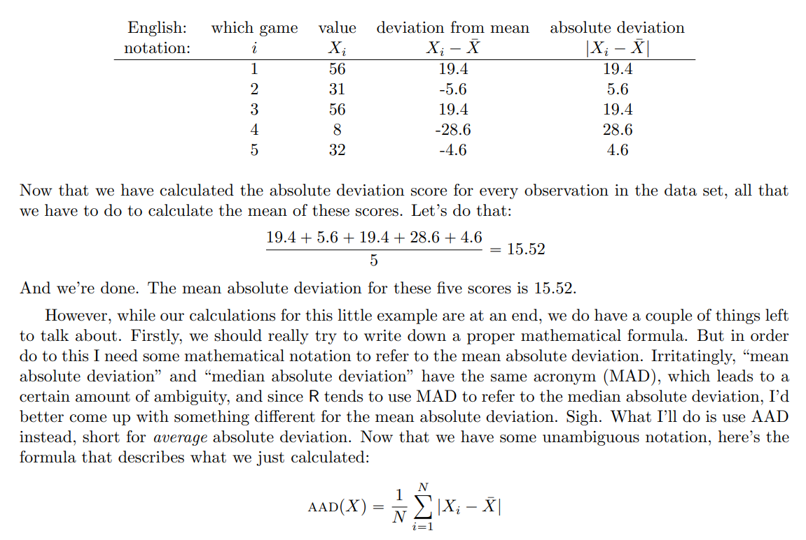
```


```{r}
X <- c(56, 31,56,8,32) # enter the data
X.bar <- mean( X ) # step 1. the mean of the data
AD <- abs( X - X.bar ) # step 2. the absolute deviations from the mean
AAD <- mean( AD ) # step 3. the mean absolute deviations
print( AAD )

aad(X) #Isr package function
```

### Variance

```{r variance,echo=FALSE, fig.align='center', fig.cap='Variance calculation',fig.width=20}
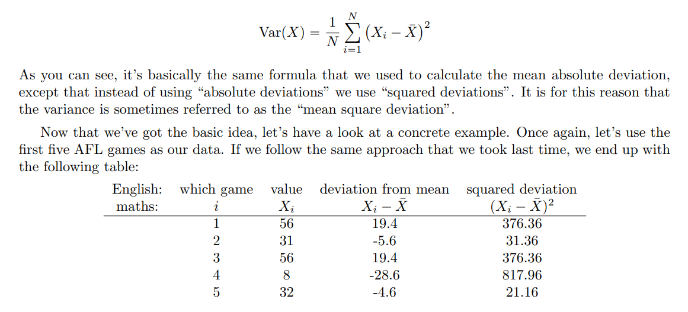
```


```{r}
( 376.36 + 31.36 + 376.36 + 817.96 + 21.16 ) / 5

mean( (X - mean(X) )^2)

var(X)


```


```{r variance sample,echo=FALSE, fig.align='center', fig.cap='Variance sample calculation',fig.width=20}
knitr::include_graphics("images/Chapter 5 Variance (sample) formula.png")
```


This is the most serious problem with the variance. Although it has some elegant mathematical properties that suggest that it really is a fundamental quantity for expressing variation, it’s completely useless if you want to communicate with an actual human... variances are completely uninterpretable in terms of the original variable! All the numbers have been squared, and they don’t mean anything anymore.

### Standard deviation

We wanted a measure that is expressed in the same units as the data itself.

```{r Standar dev form,echo=FALSE, fig.align='center', fig.cap='Standard deviation formula',fig.width=20}
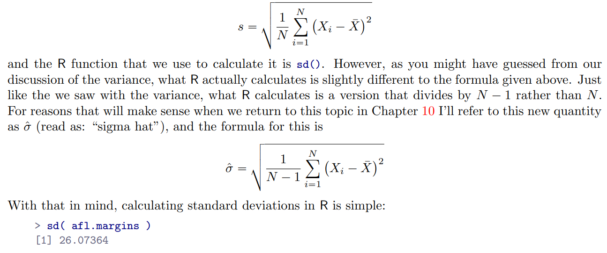
```

Interpreting standard deviations is slightly more complex. Because the standard deviation is derived
from the variance, and the variance is a quantity that has little to no meaning that makes sense to us
humans, the standard deviation doesn’t have a simple interpretation. As a consequence, most of us just
rely on a simple rule of thumb: in general, you should expect 68% of the data to fall within 1 standard
deviation of the mean, 95% of the data to fall within 2 standard deviation of the mean, and 99.7% of
the data to fall within 3 standard deviations of the mean. This rule tends to work pretty well most
of the time, but it’s not exact: it’s actually calculated based on an assumption that the histogram is
symmetric and “bell shaped” (see note).

Note: Strictly, the assumption is that the data are normally distributed, which is an important concept that we’ll discuss more in Chapter 9, and will turn up over and over again later in the book.

### Which measure to use?
We’ve discussed quite a few measures of spread (range, IQR, MAD, variance and standard deviation),
and hinted at their strengths and weaknesses. Here’s a quick summary:

* Range. Gives you the full spread of the data. It’s very vulnerable to outliers, and as a consequence
it isn’t often used unless you have good reasons to care about the extremes in the data.

* Interquartile range. Tells you where the “middle half” of the data sits. It’s pretty robust, and complements the median nicely. This is used a lot.

* Mean absolute deviation. Tells you how far “on average” the observations are from the mean. It’s very interpretable, but has a few minor issues (not discussed here) that make it less attractive to statisticians than the standard deviation. Used sometimes, but not often.

* Variance. Tells you the average squared deviation from the mean. It’s mathematically elegant, and is probably the “right” way to describe variation around the mean, but it’s completely uninterpretable because it doesn’t use the same units as the data. Almost never used except as a mathematical tool; but it’s buried “under the hood” of a very large number of statistical tools.

* Standard deviation. This is the square root of the variance. It’s fairly elegant mathematically, and it’s expressed in the same units as the data so it can be interpreted pretty well. In situations where the mean is the measure of central tendency, this is the default. This is by far the most popular measure of variation.

* Median absolute deviation. The typical (i.e., median) deviation from the median value. In the raw form it’s simple and interpretable; in the corrected form it’s a robust way to estimate the standard deviation, for some kinds of data sets. Not used very often, but it does get reported sometimes. 

In short, the IQR and the standard deviation are easily the two most common measures used to report the variability of the data; but there are situations in which the others are used. I’ve described all of them in this book because there’s a fair chance you’ll run into most of these somewhere.

## 5.3 Skew and kurtosis

**Skewness** is a measure of asymetry
```{r skewness,echo=FALSE, fig.align='center', fig.cap='An ilustration of skewness',fig.width=20}
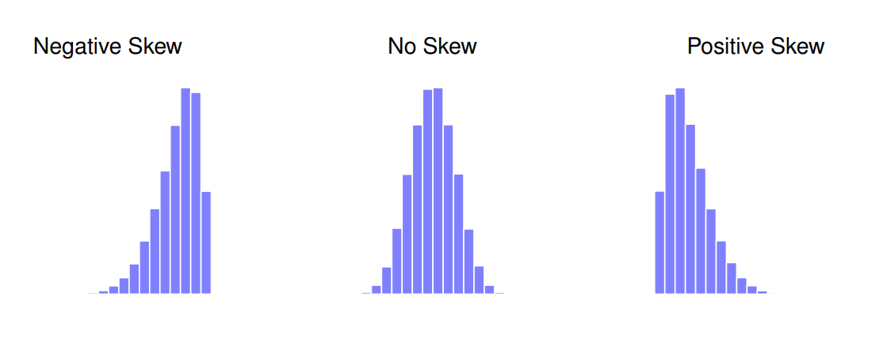
```

The actual formula for the skewness of a data set is as follows:
where *N* is the number of observations, *X¯* is the sample mean, and *ˆσ* is the standard deviation (the “divide by *N*-1” version, that is). 

Skewness is a measure of asymetry
```{r skewness formula,echo=FALSE, fig.align='center', fig.cap='Skewness formula',fig.width=20}
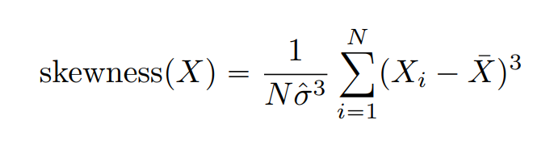
```

a funtion in ```psych``` package
```{r}
psych::skew( x = afl.margins )
```


**Kurtosis** is a measure of the “pointiness” of a data set, as illustrated in Figure 5.5.
By convention, we say that the “normal curve” (black lines) has zero kurtosis, so the pointiness of a data set is assessed relative to this curve

```{r kurtosis,echo=FALSE, fig.align='center', fig.cap='Kurtosis',fig.width=20}
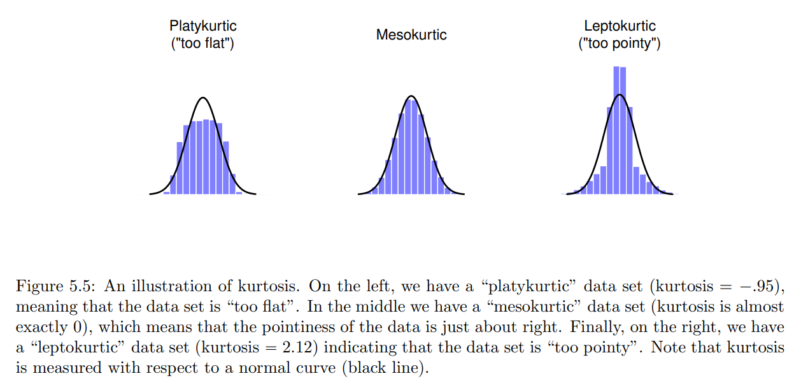
```

Summarised in the table below
```{r kurtosis table,echo=FALSE, fig.align='center', fig.cap='Kurtosis table',fig.width=20}
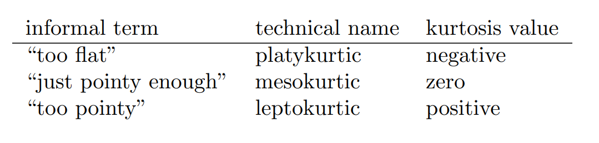
```


```{r kurtosis formula,echo=FALSE, fig.align='center', fig.cap='Kurtosis formula',fig.width=20}
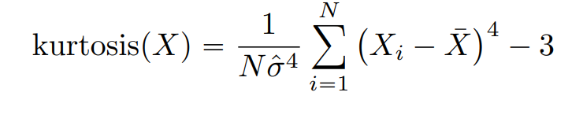
```

R function in ```psych``` package
```{r}
psych::kurtosi(afl.margins)
```

## Getting an overall summary of a variable
```summary``` function is tricky as it is a generic function. The results will differ quite dramatically depending on the class of the object that you give it

For a numeric object
```{r}
class(afl.margins)
dplyr::glimpse(afl.margins)

summary(afl.margins)
```

For a logical object
```{r}
bl_log <- afl.margins>50

dplyr::glimpse(bl_log)

summary(bl_log)
```

For a factor object
```{r}
dplyr::glimpse(afl.finalists)

summary(afl.finalists) # result is a frequency table
```

### "Summarising a data frame
```{r}
load("data/clinicaltrial.Rdata")

who(TRUE)

summary(clin.trial)
```


### Describing a data frame

```describe()``` of ```psych``` package, unlike the summary() function, it calculates the same
descriptive statistics for any type of variable you give it. 
```{r describe function,echo=FALSE, fig.align='center', fig.cap='describe function',fig.width=20}
knitr::include_graphics("images/Chapter 5 Describe function.png")
```

What the ```describe()``` function does is convert factors and logical variables to numeric vectors in order to do the calculations. These variables are marked with * and most of the time, the descriptive statistics for those variables won’t make much sense.
```{r}
psych::describe(clin.trial)
```

## 5.5 Descriptive statistics for each group
```{r}
psych::describeBy(x=clin.trial,group = clin.trial$therapy)
```

What if you have multiple grouping variables? 
Suppose, for example, you would like to look at the average mood gain separately for all possible combinations of drug and therapy. It is actually possible to do this using the by() and describeBy() functions, but I usually find it more convenient to use the aggregate() function in this situation. There are again three arguments that you need to specify. The formula argument is used to indicate which variable you want to analyse, and which variables are used to specify the groups. For instance, if you want to look at mood.gain separately for each possible combination of drug and therapy, the formula you want is mood.gain ~ drug + therapy. The data argument is used to specify the data frame containing all the data, and the FUN argument is used to indicate what function you want to calculate for each group (e.g., the mean). So, to obtain group means, use this command:
```{r}
aggregate(mood.gain ~ drug+therapy, # mood.gain by drug/therapy combination
          data = clin.trial, # data is in the clin.trial data frame
          FUN = mean) # print out group means
```

### Standard scores

Describe my grumpiness by comparing me to other people. Shockingly, out of my friend’s sample of 1,000,000 people, only 159 people were as grumpy as me, suggesting that I’m in the top 0.016% of people for grumpiness. This makes much more sense than trying to interpret the raw data (or saying I am 70% grumpiness). This idea – that we should describe my grumpiness in terms of the overall distribution of the grumpiness of humans – is the qualitative idea that standardisation attempts to get at. 

One way to do this is to do exactly what I just did, and describe everything in terms of percentiles. However, the problem with doing this is that “it’s lonely at the top”. Suppose that my friend had only collected a sample of 1000 people, and this time gotten a mean of 16 out of 50 with a standard deviation of 5, let’s say. The problem is that almost certainly, not a single person in that sample would be as grumpy as me. Percentiles represent the relative position of a data point within a distribution.

However, all is not lost. A different approach is to convert my grumpiness score into a standard
score, also referred to as a z-score. are a statistical concept used in mathematics to compare and interpret data. They measure the relative position of a particular data point or value within a distribution. The purpose of standard scores is to provide a standardized and normalized representation of data, enabling meaningful comparisons across different datasets.

calculated like this:
```{r standard scores,echo=FALSE, fig.align='center', fig.cap='standard scores formula',fig.width=20}
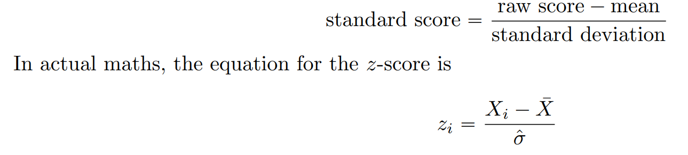
```
If the mean is 17 and the standard deviation is 5 then my standardised grumpiness score would be
```{r}
z = (35-17)/5
z

pnorm( 3.6 )
```
To interpret this value, recall the rough heuristic that I provided in Section 5.2.5, in which I noted that 99.7% of values are expected to lie within 3 standard deviations of the mean. So the fact that my grumpiness corresponds to a z score of 3.6 indicates that I’m very grumpy indeed. 

Function called ```pnorm()``` allows us to calculate a theoretical percentile rank for my grumpiness (details in secion 9.5), but now it suggests that I’m grumpier than 99.98% of people.


### Correlations

So far we have focused entirely on how to construct descriptive statistics for a single variable. Now, how to describe the relationships between variables in the data, i. est. correlation between variables.

### The data

I’m curious to find out how much my infant son’s sleeping habits affect my mood. Let’s say that I can rate my grumpiness very precisely, on a scale from 0 (not at all grumpy) to 100 (grumpy as a very, very grumpy old man). And, lets also assume that I’ve been measuring my grumpiness, my sleeping patterns and my son’s sleeping patterns for quite some time now. Let’s say, for 100 days.  If we load the data...
```{r}
load( "data/parenthood.Rdata" )
who(TRUE)

parenthood
```

```{r}
psych::describe(parenthood)
```


```{r sleep data,echo=FALSE, fig.align='center', fig.cap='sleep data',fig.width=20}
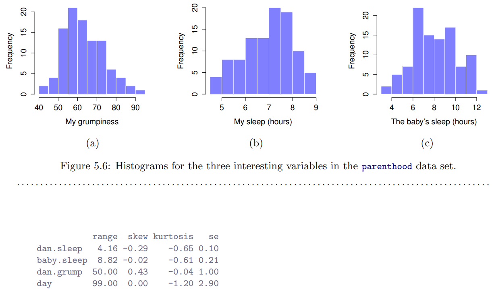
```

### The strength and direction of a relationship


If we compare the scatterplot of “baby.sleep v dan.grump” to the scatterplot of “‘baby.sleep v dan.sleep”, the overall strength of the relationship is the same, but the direction is different. That is, if my son sleeps more, I get more sleep (positive relationship, right hand side), but if he sleeps more then I get less grumpy (negative relationship, left hand side).

```{r}
parenthood |>
  ggplot2::ggplot(ggplot2::aes(x=dan.sleep,y=dan.grump)) +
  ggplot2::geom_point(colour="blue")+
  ggplot2::theme_test()

parenthood |>
  ggplot2::ggplot(ggplot2::aes(x=baby.sleep,y=dan.grump)) +
  ggplot2::geom_point(colour="red")+
  ggplot2::theme_test()
```

### The correlation coeficient

Correlation coefficient (or, more specifically, Pearson’s correlation coefficient), which is traditionally denoted by **r**. 

The correlation coefficient between two variables X and Y (sometimes denoted rXY ), which we’ll define more precisely in the next section, is a measure that varies from -1 to 1. When r =-1 it means that we have a perfect negative relationship, and when r =1 it means we have a perfect positive relationship. When r =0, there’s no relationship at all. If you look at Figure 5.9, you can see several plots showing what different correlations look like.


```{r types of correlations coef,echo=FALSE, fig.align='center', fig.cap='Illustration of the effect of varying the strength and direction of a correlation. In the left hand column, the correlations are 0, .33, .66 and 1. In the right hand column, the correlations are 0, -.33, -.66 and -1',fig.width=20}
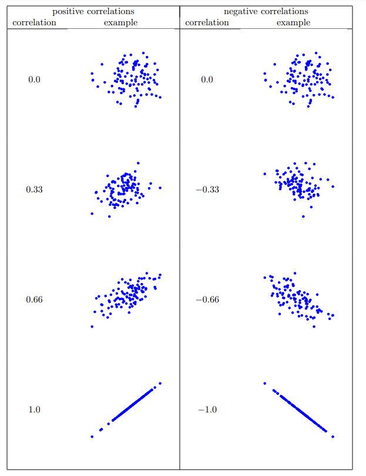
```

The formula for the Pearson’s correlation coefficient can be written in several different ways. I think the simplest way to write down the formula is to break it into two steps. Firstly, let’s introduce the idea of a covariance. The covariance between two variables X and Y is a generalisation of the notion of the variance; it’s a mathematically simple way of describing the relationship between two variables that isn’t terribly informative to humans.

Because we’re multiplying (i.e., taking the “product” of) a quantity that depends on X by a quantity that depends on Y and then averaging, you can think of the formula for the covariance as an “average cross product” between X and Y . 

So, in simpler terms, the covariance formula calculates how much the values of X and Y vary together. 

The covariance has the nice property that, if X and Y are entirely unrelated, then the covariance is exactly zero. If the relationship between them is positive then the covariance is also positive; and if the relationship is negative then the covariance is also negative. In other words, the covariance captures the basic qualitative idea of correlation. 

Unfortunately, the raw magnitude of the covariance isn’t easy to interpret: it depends on the units in which X and Y are expressed, and worse yet, the actual units that the covariance itself is expressed in are really weird. For instance, if X refers to the dan.sleep variable (units: hours) and Y refers to the dan.grump variable (units: grumps), then the units for their covariance are “hours x grumps”. And I have no idea what that would even mean.

Lack of Standardization: Covariation does not provide a standardized measure of association. It is affected by the scales and units of measurement of the variables involved. This can make it difficult to compare the strength of associations across different studies or variables.
```{r covariance,echo=FALSE, fig.align='center', fig.cap='covariance formula',fig.width=20}
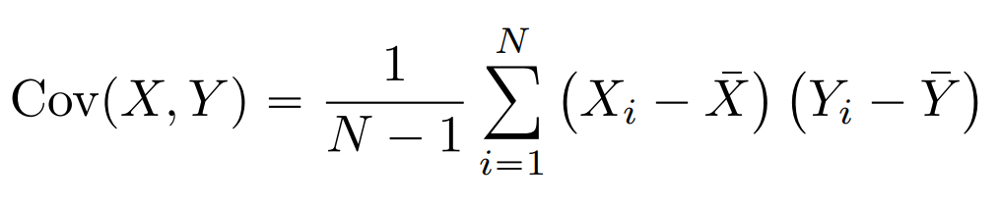
```

The Pearson correlation coefficient r fixes this interpretation problem by standardising the covariance, in pretty much the exact same way that the z-score standardises a raw score: by dividing by the standard deviation. However, because we have two variables that contribute to the covariance, the standardisation only works if we divide by both standard deviations.In other words, the correlation between X and Y can be written as below.

By doing this standardisation, not only do we keep all of the nice properties of the covariance discussed earlier, but the actual values of r are on a meaningful scale: r “ 1 implies a perfect positive relationship, and r “ ´1 implies a perfect negative relationship.

```{r Pearson coefficient,echo=FALSE, fig.align='center', fig.cap='Pearsons coefficeint',fig.width=20}
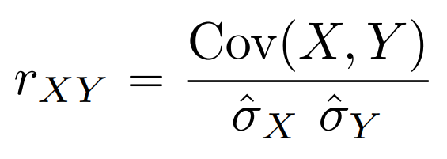
```


### Calculating correlations in R

The simpliest way:
```{r}
cor( x = parenthood$dan.sleep, y = parenthood$dan.grump )

parenthood |>
  ggplot2::ggplot(ggplot2::aes(x=dan.sleep,y=dan.grump)) +
  ggplot2::geom_point(colour="red")+
  ggplot2::theme_test()
```

The function is more powerful
```{r}
cor(parenthood)
```

### Interpreting a correlation

It depends on what you want to use the data for, and on how strong the correlations in your field tend to be.The interpretation of a correlation depends a lot on the context. 

For instance, one of the benchmark data sets used to test theories of how people judge similarities is so clean that any theory that can’t achieve a correlation of at least .9 really isn’t deemed to be successful. 

That said, the rough guide in Table 5.2 is pretty typical.

```{r Corr interpret,echo=FALSE, fig.align='center', fig.cap='A rough guide to interpreting correlations. Note that I say a rough guide. There aren not hard and fast rules for what counts as strong or weak relationships. It depends on the contex',fig.width=20}
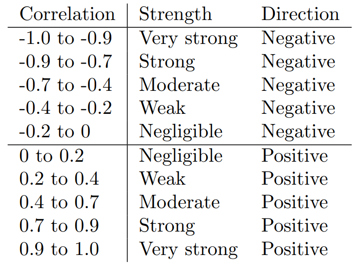
```


However, something that can never be stressed enough is that you should always look at the scatterplot before attaching any interpretation to the data. A correlation might not mean what you think it means.
 
Anscombe's Quartet refers to a set of four datasets that have nearly identical statistical properties, yet exhibit starkly different distributions and relationships when visualized. The quartet was introduced by the statistician Francis Anscombe in 1973 to emphasize the importance of data visualization and the limitations of relying solely on summary statistics.

```{r Anscombe Quartet,echo=FALSE, fig.align='center', fig.cap='Anscombes Quartet',fig.width=20}
knitr::include_graphics("images/Chapter 5 Anscombe’s Quartet.png")
```


### Spearman’s rank correlations

The Pearson correlation coefficient is useful for a lot of things, but it does have shortcomings. One issue, in particular, stands out: what it actually measures is the strength of the **linear** relationship between two variables. 

One very common situation where the Pearson correlation isn’t quite the right thing to use arises when an increase in one variable X really is reflected in an increase in another variable Y, but the nature of the relationship isn’t necessarily linear. 

To illustrate, consider the data plotted in Figure 5.11, showing the relationship between hours worked and grade received for 10 students taking some class. The curious thing about this – highly fictitious – data set is that increasing your effort always increases your grade. It might be by a lot or it might be by a little, but increasing effort will never decrease your grade. The data are stored in effort.Rdata:

```{r}
load( "data/effort.Rdata" )
who(TRUE)

effort
```


```{r hours worked and grade received,echo=FALSE, fig.align='center', fig.cap='Relation hours worked and grade received',fig.width=20}
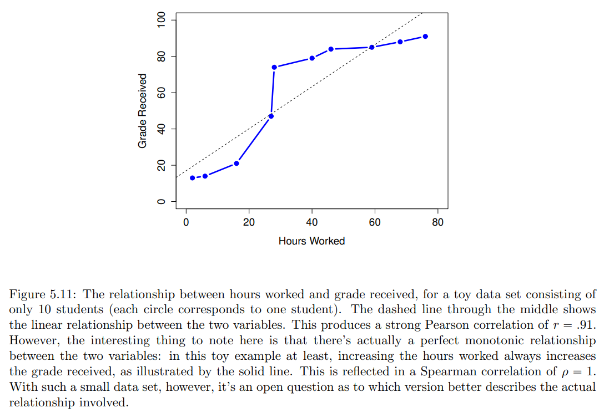
```


If we run a standard Pearson correlation, it shows a strong relationship between hours worked and grade received but this doesn’t actually capture the observation that increasing hours worked always increases the grade.

There’s a sense here in which we want to be able to say that the correlation is perfect but for a somewhat different notion of what a “relationship” is. What we’re looking for is something that captures the fact that there is a perfect ordinal relationship here. That is, if student 1 works more hours than student 2, then we can guarantee that student 1 will get the better grade. That’s not what a correlation of r “ .91 says at all.


```{r}
cor( effort$hours, effort$grade )
```


How should we address this? Actually, it’s really easy: if we’re looking for ordinal relationships, all we have to do is treat the data as if it were ordinal scale! So, instead of measuring effort in terms of “hours worked”, lets rank all 10 of our students in order of hours worked. That is, student 1 did the least work out of anyone (2 hours) so they get the lowest rank (rank = 1). Student 4 was the next laziest, putting in only 6 hours of work in over the whole semester, so they get the next lowest rank (rank = 2). Notice that I’m using “rank =1” to mean “low rank”. Sometimes in everyday language we talk about “rank = 1” to mean “top rank” rather than “bottom rank”. So be careful: you can rank “from smallest value to largest value” (i.e., small equals rank 1) or you can rank “from largest value to smallest value” (i.e., large equals rank 1). In this case, I’m ranking from smallest to largest, because that’s the default way that R does it. But in real life, it’s really easy to forget which way you set things up.

```{r rank,echo=FALSE, fig.align='center', fig.cap='Ranj',fig.width=20}
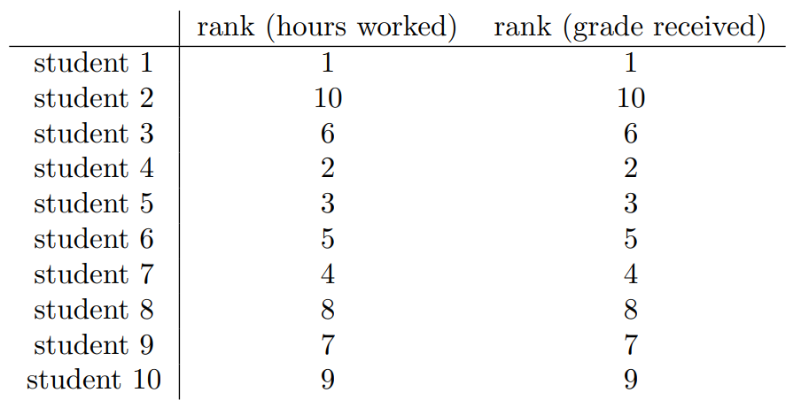
```

These are identical. The student who put in the most effort got the best grade, the student with the least effort got the worst grade, etc. We can get R to construct these rankings using the rank() function, like this:

```{r}
hours.rank <- rank( effort$hours ) # rank students by hours worked
grade.rank <- rank( effort$grade ) 
```


```{r}
cor( hours.rank, grade.rank )
```

What we’ve just re-invented is Spearman’s rank order correlation, usually denoted ρ to distinguish it from the Pearson correlation r. We can calculate Spearman’s ρ using R in two different ways. Firstly we could do it the way I just showed, using the rank() function to construct the rankings, and then calculate the Pearson correlation on these ranks. However, that’s way too much effort to do every time. It’s much easier to just specify the method argument of the cor() function.
```{r}
cor( effort$hours, effort$grade, method = "spearman")
```

### The correlate() function

The function it’s not built to handle non-numeric variables.
```{r}
load("data/work.Rdata")
head(work)

lsr::correlate(work)

#cor(work)
```

## 5.8 Handling missing values

### The single variable case

```{r}
partial <- c(10, 20, NA, 30)

mean( x = partial, na.rm = TRUE )
```

### Missing values in pairwise calculations
```{r}
load( "data/parenthood2.Rdata" )
print( parenthood2 )

psych::describe(parenthood)
psych::describe(parenthood2)
```
 If we specify use = "complete.obs", R will completely ignore all cases (i.e., all rows in our parenthood2 data frame) that have any missing values at all. So, for instance, if you look back at the extract earlier when I used the head() function, notice that observation 1 (i.e., day 1) of the parenthood2 data set is missing the value for baby.sleep, but is otherwise complete? Well, if you choose use = "complete.obs" R will ignore that row completely: that is, even when it’s trying to calculate the correlation between dan.sleep and dan.grump, observation 1 will be ignored, because the value of baby.sleep is missing for that observation. 

The other possibility that we care about, and the one that tends to get used more often in practice, is to set use = "pairwise.complete.obs". When we do that, R only looks at the variables that it’s trying to correlate when determining what to drop. So, for instance, since the only missing value for observation 1 of parenthood2 is for baby.sleep R will only drop observation 1 when baby.sleep is one of the variables involved: and so R keeps observation 1 when trying to correlate dan.sleep and dan.grump. 
```{r}
cor( parenthood2 )

cor(parenthood2, use = "complete.obs")

cor(parenthood2, use = "pairwise.complete.obs")
```

The two approaches have different strengths and weaknesses. The “pairwise complete” approach has the advantage that it keeps more observations, so you’re making use of more of your data and (as we’ll
discuss in tedious detail in Chapter 10) and it improves the reliability of your estimated correlation. On the other hand, it means that every correlation in your correlation matrix is being computed from
a slightly different set of observations, which can be awkward when you want to compare the different correlations that you’ve got.

So which method should you use? It depends a lot on why you think your values are missing, and probably depends a little on how paranoid you are. 


## Meeting Videos

### Cohort 1

`r knitr::include_url("https://www.youtube.com/embed/URL")`

<details>
<summary> Meeting chat log </summary>

```
LOG
```
</details>
